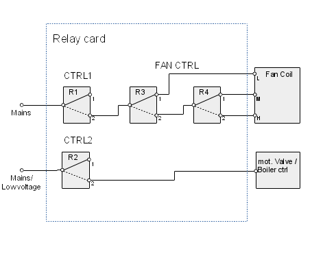

# Thermostat module

## Description

This module implements a thermostat algorithm to control the temperature of one zone. Depending on the operating mode, the desired target temperature is specified and compared with the real temperature measured via a sensor in the controlled zone. As a result of this comparison a control is activated (relay switch) to change the zone's temperature. The control acting on the temperature can be a heater or an air condition unit, depending on the season mode. Two separate control units are supported to cover most plant configurations.  

The temperature is measured with a Modbus request to the Sensor module and the control is activated with a Modbus request to the Control module.  

The algorithm can work in different operating modes (see below), allowing for great flexibility and easy usage.  

The module works autonomously, reading it's input parameters from a configuration file which is stored locally. This makes the algorithm independent from an external network connection which could fail any time. To change the configuration e.g. operating mode, target temperature or the schedule, the user can use a GUI on a separate machine (smart phone, web browser) which creates the configuration file and uploads it to the remote device running the thermostat algorithm. Updating the local configuration requires a working network connection.  
&nbsp;

### Supported season modes

* *Summer* - Cooling, Air condition
* *Winter* - Heating
&nbsp;

### Supported operating modes

* *Daily Schedule*   
A schedule for every day of the week can be specified with a different “goal” temperature for each scheduled period.  If there is a gap between periods, the heater/air-condition unit  will be off during that time frame. There is no limit on the number of periods which can be specified for each day.  

* *Temporary Override*   
A single temperature can be specified to override the scheduled temperature within the scheduled period according to the daily schedule.  

* *Immediate*   
A single temperature can be specified to override immediately any scheduled temperature until the operational mode is changed manually  

* *Off*   
The thermostat functions and the heater/air-condition unit are off.  
&nbsp;

### Global parameters

* *Maximum temperature*   
Highest temperature setting accepted by the algorithm

* *Minimum temperature*   
Lowest temperature setting accepted by the algorithm (anti freeze)

* *Hysteresis temperature*   
DT to be applied to the set temperature before switching

* *Minimum idle time*   
Period of time that the heater/ air-condition unit is required to be shut off before it is allowed to be turned on again

* *Maximum operating time*   
Maximum time the heater/air-condition unit is allowed to be switched on

* *Cycle period*   
Period of time between running two algorithm cycles
&nbsp;

### Cooling/heating device control

In order to cover most of the common plant configurations, the thermostat supports two separate cooling/heating devices. Usually these are a fan coil and a boiler/heat pump providing hot water to the radiators or radiating floor. The devices will be controlled only if they are enabled in the configuration.  

A disabled device will not be controlled.  

A total of 4 relays are needed to control the two devices on/off and 3 fan speeds. The following picture shows the cabling scheme.  

  
&nbsp;

The following tables show the relay settings for controlling the 2 devices.  

R1|Fan coil
--|--------
1 |off
2 |on (see below table for speed  control)
  
  
R2|Boiler
--|--------
1 |off
2 |on 
  
  
The following table shows the relay settings for controlling the 3 fan speeds.  

R3|R4|FanSpeed
--|--|-------------
1|don't care|L (1)
2|1         |M (2)
2|2         |H (3)
&nbsp;

### Configuration

The configuration of the thermostat algorithm is done via a JSON format configuration file. All parameters needed by the algorithm are stored in this file.  

The parameters are defined by the user via an intuitive Web GUI on the Telegea server which will then generate the configuration file and send it to the remote device (alternatively the remote device can request the configuration file via a WebAPI call).  

#### Configuration file

<pre>
  "season_mode": "summer" | "winter"
  "operation_mode": "daily_schedule" | "immediate" | "temp_override" | "off",
  "daily_schedule": [
   {
    "weekday":"sunday", 
    "times_of_operation": [
      {"start": "00:00", "stop": "10:00", "temp": 15},
      ...
      {"start": "22:00", "stop": "00:00", "temp": 18}
   ]},
   {
    "weekday":"monday", 
    "times_of_operation": [
      {"start": "00:00", "stop": "08:00", "temp": 15},
      ...
      {"start": "14:00", "stop": "18:30", "temp": 20}
   ]},
   {
    "weekday":"tuesday", 
    "times_of_operation": [
      {"start": "00:00", "stop": "08:00", "temp": 15},
      ...
      {"start": "14:00", "stop": "18:30", "temp": 20}
   ]},
   {
    "weekday":"wednesday", 
    "times_of_operation": [
      {"start": "00:00", "stop": "08:00", "temp": 15},
      ...
      {"start": "17:00", "stop": "23:00", "temp": 19.5}
   ]},
   {
    "weekday":"thursday", 
    "times_of_operation": [
      {"start": "00:00", "stop": "08:00", "temp": 15},
      ...
      {"start": "14:00", "stop": "18:30", "temp": 20}
   ]},
   {
    "weekday":"friday", 
    "times_of_operation": [
      {"start": "00:00", "stop": "08:00", "temp": 17},
      ...
      {"start": "16:00", "stop": "18:30", "temp": 22}
   ]},
   {
    "weekday":"saturday", 
    "times_of_operation": [
      {"start": "00:00", "stop": "10:00", "temp": 15},
      ...
      {"start": "10:00", "stop": "00:00", "temp": 21}
   ]}],
  "immediate": {"temp": 26},
  "temp_override": {"time_stamp": "1425565570", "temp": 19},
  "off": "off"
}
</pre>
